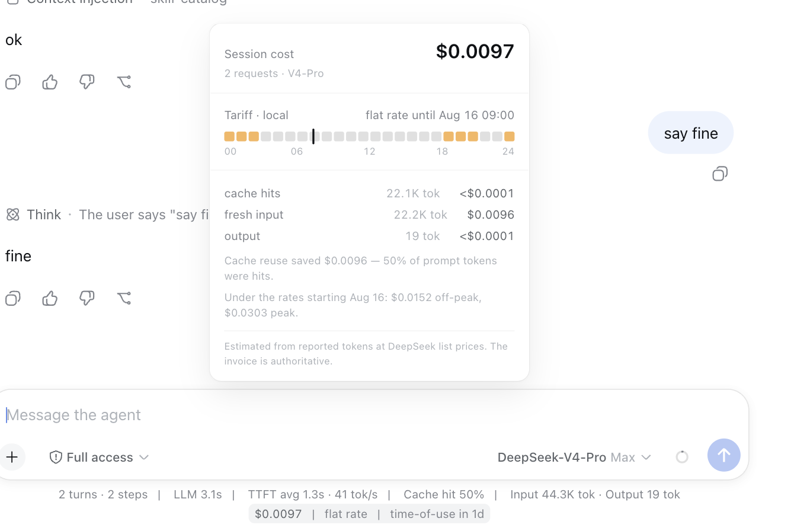
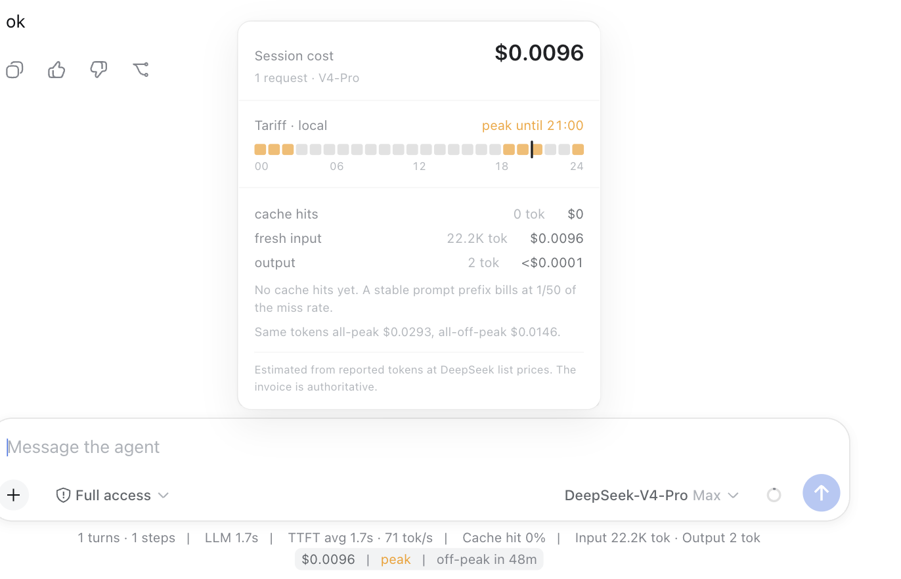

# dsh-meter

[](https://github.com/dshworks/dsh-meter/actions/workflows/ci.yml)
[](https://github.com/deepseek-ai/deepseek-harness)
[](LICENSE)

**DeepSeek now bills by time of day. This is the meter for it.**

On **2026-08-16 16:00 UTC** DeepSeek's API moved to time-of-use pricing: two peak
windows a day, off-peak at half the peak rate. Cost stopped being a number you
read afterwards and became a rate you are standing in. A spend counter tells you
what you can no longer change; a meter tells you what to do next.

`dsh-meter` puts one line under the composer — what this session has cost, which
tariff is running, and how long until it flips — and a card behind it with the
tariff clock, where the money went, and what the same tokens would have cost
under the other tariff.



## 60-second start

`dsh plugin` forwards to pnpm, so pnpm must be on PATH.

```sh
dsh plugin --profile web add github:dshworks/dsh-meter
dsh --profile web
```

Billing in CNY (the mainland platform publishes its own table, not a converted
one) — add to your profile's `cordis.patch.yml`:

```yaml
- id: dsh-meter
  config:
    currency: cny
```

## What you see

```
1 turns · 1 steps | LLM 1.7s | TTFT avg 1.7s · 71 tok/s | Cache hit 0% | Input 22.2K tok · Output 2 tok
                       $0.0096  |  peak  |  off-peak in 48m
```

The stock stats line, untouched, and ours under it — this plugin adds a line, it
does not replace the harness's. Hover or focus it for the card. Inside a peak
window the tariff is called out and the countdown runs to the next off-peak
hour:



| The card shows | Why it is there |
|---|---|
| The session total, request count, models | The number, once, at full size |
| A 24-hour tariff strip in **your** local time, with a live now-marker | Peak windows are published in UTC. Reading them off a strip beats doing timezone arithmetic at 11pm |
| cache hits / fresh input / output, tokens and money each | Cache hits cost 1/50th of a miss. This is the line that shows whether your prompt prefix is stable |
| What the same tokens cost at the other tariff | Before the switchover: what the new rates will do to this session. After: what waiting for off-peak is worth |
| What the cache saved | The counterfactual where every hit had been a miss |

## The rate card

Both tables are published by DeepSeek, per 1M tokens, and are carried verbatim
in [`lib/core.js`](lib/core.js) — the USD table is the international platform's
and the CNY table the mainland one; neither is a conversion of the other.

| | cache hit | cache miss | output |
|---|---|---|---|
| **v4-flash** flat *(until Aug 16 16:00 UTC)* | $0.0028 | $0.14 | $0.28 |
| v4-flash off-peak | $0.007 | $0.22 | $0.66 |
| v4-flash peak | $0.014 | $0.44 | $1.32 |
| **v4-pro** flat *(until Aug 16 16:00 UTC)* | $0.003625 | $0.435 | $0.87 |
| v4-pro off-peak | $0.022 | $0.66 | $1.98 |
| v4-pro peak | $0.044 | $1.32 | $3.96 |

Peak is **01:00-04:00 and 06:00-10:00 UTC** (09:00-12:00 and 14:00-18:00
Beijing). Every other hour is off-peak, including the two-hour gap between the
windows. Off-peak is exactly half of peak — and still above the flat rate it
replaced, by about 2.4x on output.

Source: <https://api-docs.deepseek.com/quick_start/pricing>.

## How the money is counted

| Behavior | Detail |
|---|---|
| Source of truth | Provider-reported token counts in the session log. Nothing is sampled, estimated, or fetched — this plugin makes no network call and reads no API key |
| Tariff per request | Decided by **dispatch** time (`step/start`), not by when the answer finished. A request sent at 00:59 UTC is billed off-peak even if it streams into the peak window. A session that spans a boundary is billed correctly on both sides |
| Billed buckets | `inputTokens` at the cache-MISS rate, `cacheReadTokens` at the cache-HIT rate, `outputTokens` at the output rate. The harness reports these disjoint (the DeepSeek adapter subtracts hits out of `prompt_tokens`), and reasoning tokens are already inside output |
| Cache writes | Folded into the miss bucket. DeepSeek publishes no separate write price and bills a first-time prompt at the miss rate; the DeepSeek adapter never reports one |
| Failed requests | A step's usage chunk is counted even when the request then fails; the finalized message REPLACES that sample rather than adding to it, including when the message names a different model than the request header did |
| Unknown models | Counted and named, never priced. A model with no published rate contributes tokens and requests to the readout and zero money, and the card says so |
| Durability | One session projection (`costMeter`), folded from the durable log. It survives paging, compaction, a page reload, and a server restart, and it is checkpointed by the standard projection cache |

## Model Experience

None. `dsh-meter` adds no tool, no system-prompt section, no message, and no
model call; it does not touch the request. Cost belongs to the person paying,
not to the agent's context window.

#### KV Cache effect

None — the plugin never participates in a request.

## Configuration

| Key | Default | Meaning |
|---|---|---|
| `currency` | `usd` | The rate card to bill against: `usd` (international platform) or `cny` (mainland). A currency, not an exchange rate |

## Development

```sh
pnpm install
pnpm test          # checks the generated bundle is in sync, then runs vitest
node scripts/build-client.mjs    # regenerate lib/client.js after editing core/ui
```

`lib/core.js` holds the rate card, the tariff clock, and the fold. `src/ui.js`
holds the browser surface. `scripts/build-client.mjs` inlines both into
`lib/client.js`, the bundle the harness serves — so the price table exists in
exactly one file, and `pnpm test` fails if the generated bundle drifts from it.

## Known limitations

- **It is an estimate, not the invoice.** List prices times reported tokens.
  Promotional balances, granted credits, and any relay or proxy in front of the
  API are invisible to it.
- **Tariff is inferred from the dispatch timestamp**, which is the harness's
  clock. A request that DeepSeek receives on the far side of a boundary can bill
  differently by a second or two.
- **Non-DeepSeek routes are not priced.** Their tokens are counted and their
  model named; the card reports them as unpriced instead of quietly applying
  DeepSeek's rates to someone else's API.
- **The rate card is compiled in.** DeepSeek changes prices; this plugin ships a
  snapshot taken 2026-08-13 and needs a release to follow one.
- **Web only.** The projection is available to any surface, but the readout is
  built for the Web UI. There is no TUI line.

## License

MIT
